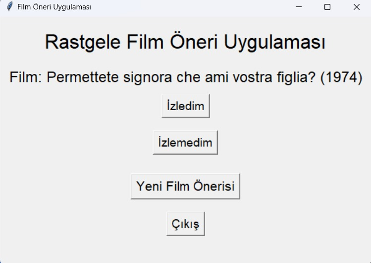

# Film Öneri Uygulaması

Bu basit Python uygulaması, rastgele bir film önerisi sunan bir araçtır. Kullanıcılar, bu uygulama aracılığıyla yeni filmler keşfedebilir veya izlemek istedikleri filmleri işaretleyebilirler.


## Nasıl Kullanılır

1. Uygulamayı çalıştırın ve "Yeni Film Önerisi" düğmesine tıklayın.
2. Karşınıza rastgele bir film önerisi gelecektir. Filmin adını ve yapım yılını göreceksiniz.
3. Eğer önerilen filmi izlediyseniz, "İzledim" düğmesine tıklayarak bu filmi işaretleyebilirsiniz.
4. Eğer önerilen filmi izlemediyseniz, "İzlemedim" düğmesine tıklayarak bu filmi işaretlemeden yeni bir film önerisi alabilirsiniz.
5. İstediğiniz zaman "Çıkış" düğmesine tıklayarak uygulamadan çıkabilirsiniz.

## Özellikler

- Rastgele film önerileri
- İzlenen filmleri işaretleme ve yeni film önerileri alma
- Basit ve kullanıcı dostu arayüz
- Çıkış seçeneği

## Bağımlılıklar

Bu uygulama aşağıdaki Python kütüphanelerine ihtiyaç duyar:

- `pandas` (Veri işleme için)
- `numpy` (Sayısal hesaplamalar için)
- `tkinter` (Grafik arayüz oluşturmak için)

## Katkıda Bulunma
Bu projeye katkıda bulunmak isterseniz, lütfen forklayın ve pull request gönderin. Katkılarınızı memnuniyetle karşılarız!


Gerekli bağımlılıkları kurmak için aşağıdaki komutları kullanabilirsiniz:

```bash
pip install pandas numpy


